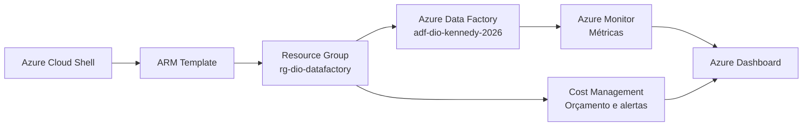
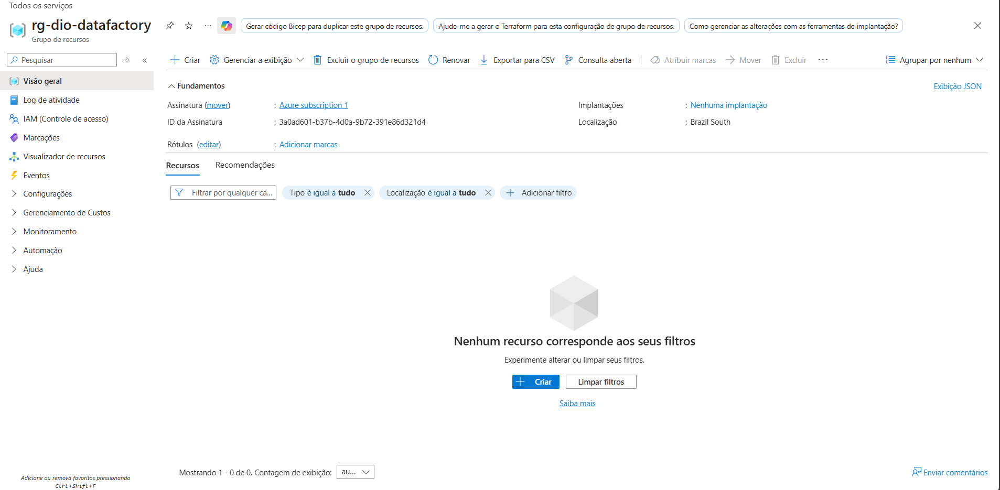
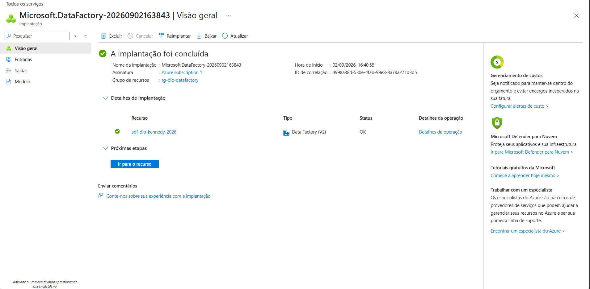
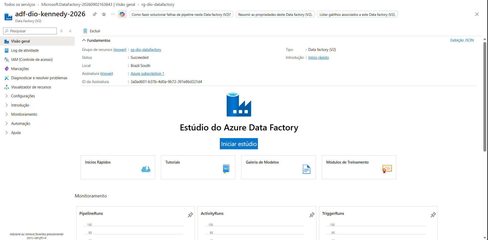
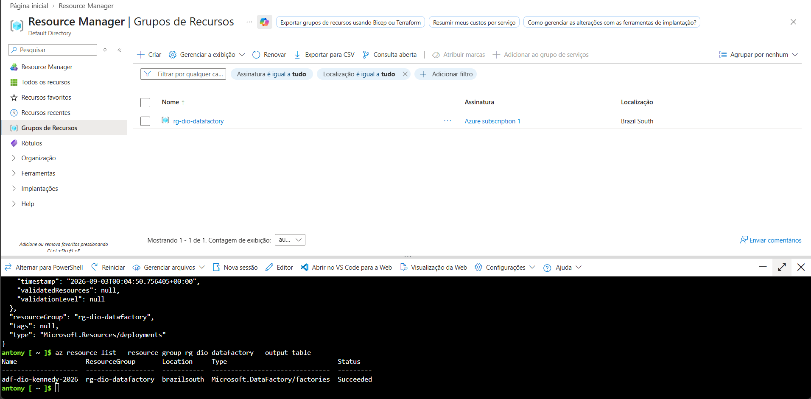
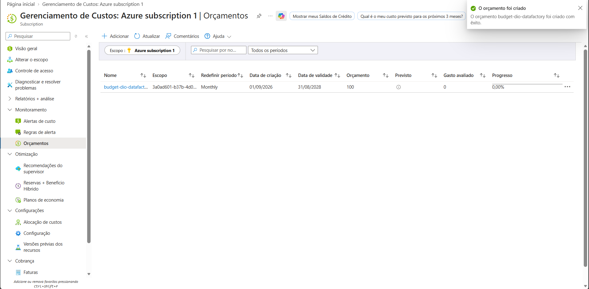
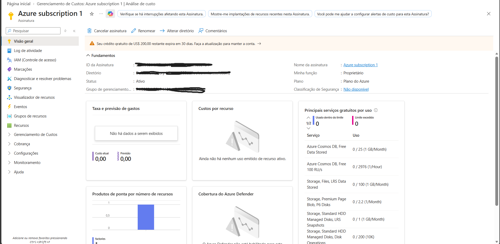
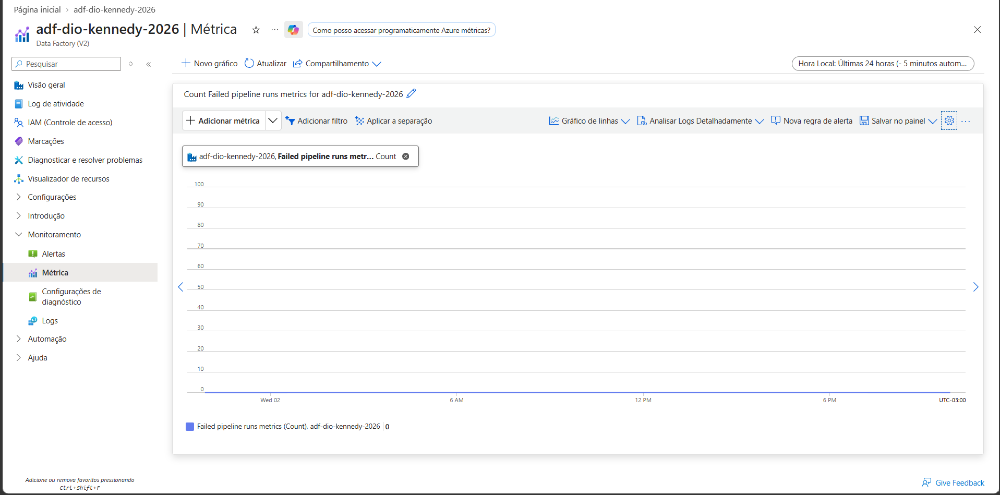
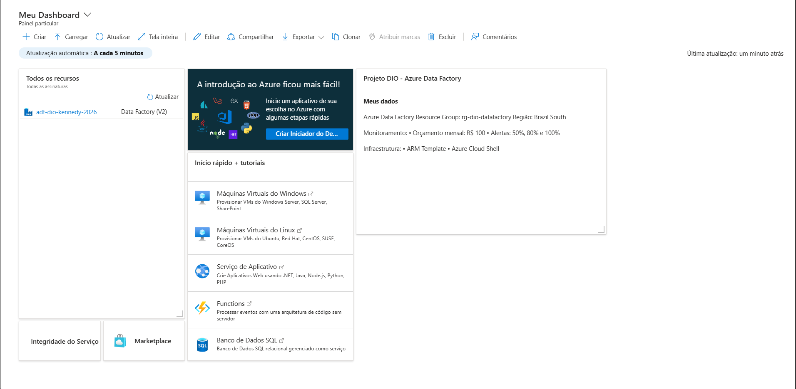

# Projeto Azure Data Factory com ARM Template

Projeto prático de Cloud Computing e Data Engineering que demonstra o provisionamento de um Azure Data Factory por Infrastructure as Code (IaC), além de monitoramento e controle de custos no Microsoft Azure.

## Objetivo

Provisionar e documentar um ambiente inicial de Azure Data Factory utilizando ARM Template e Azure Cloud Shell, aplicando também práticas básicas de monitoramento, orçamento e organização de recursos.

## Arquitetura



## Tecnologias utilizadas

- Microsoft Azure
- Azure Data Factory V2
- Azure Resource Manager (ARM Template)
- Azure Cloud Shell
- Azure CLI
- Azure Monitor
- Cost Management + Billing
- Azure Dashboard

## Recursos do ambiente

| Recurso | Configuração |
|---|---|
| Assinatura | Azure Free Trial |
| Resource Group | `rg-dio-datafactory` |
| Região | Brazil South |
| Azure Data Factory | `adf-dio-kennedy-2026` |
| IaC | ARM Template |
| Ferramentas | Azure Portal, Cloud Shell e Azure CLI |

## Etapas realizadas

1. Criação de um Resource Group para organizar os recursos do laboratório.
2. Provisionamento de um Azure Data Factory V2 na região Brazil South.
3. Exploração do Azure Data Factory Studio e de seus componentes principais.
4. Criação de um ARM Template para representar a infraestrutura como código.
5. Implantação do template pelo Azure Cloud Shell com Azure CLI.
6. Criação de um orçamento mensal e alertas de custo.
7. Consulta de métricas do Azure Data Factory.
8. Criação de um dashboard para centralizar o acompanhamento do ambiente.

## Estrutura do repositório

```text
.
├── evidencias/
│   ├── 01-resources-manager.png.png
│   ├── 02-data-factory.png.png
│   ├── 03-data-factory-studio.png.png
│   ├── 04-cloud-shell-arm-deployment.png.png
│   ├── 05-orcamento-custos.png.png
│   ├── 06-analise-custo-assinatura.png.png
│   ├── 07-metricas-data.png.png
│   └── 08-dashboard-azure.png.png
├── README.md
└── template.json
```

## Evidências

### Resource Group



### Azure Data Factory



### Data Factory Studio



### Implantação com ARM Template



### Orçamento e alertas de custo



### Análise de custos



### Métricas do Data Factory



### Dashboard Azure



## Principais aprendizados

- O Azure Data Factory é um serviço de integração de dados que centraliza a criação e a orquestração de pipelines.
- O ARM Template permite descrever e provisionar infraestrutura de forma repetível e versionável.
- O Azure Cloud Shell possibilita executar comandos do Azure CLI diretamente no portal.
- Orçamentos e alertas contribuem para o uso responsável de uma assinatura de avaliação.
- Métricas e dashboards ajudam a acompanhar a saúde e a utilização dos recursos em nuvem.

## Possíveis evoluções

- Criar pipelines de cópia entre fontes locais e o Azure Data Lake Storage Gen2.
- Configurar gatilhos agendados e monitorar as execuções das pipelines.
- Parametrizar o ARM Template para múltiplos ambientes.
- Adotar Azure Key Vault para armazenar segredos e credenciais.
- Automatizar implantações com CI/CD.

## Observação sobre custos

O projeto foi desenvolvido em uma assinatura Azure Free Trial. Os recursos devem ser revisados e removidos quando não forem mais necessários, evitando consumo indevido do crédito de avaliação.

## Autor

Antony Kennedy Ribeiro de Araújo

Projeto desenvolvido como parte do bootcamp Microsoft AI for Tech - Azure Databricks da DIO.
